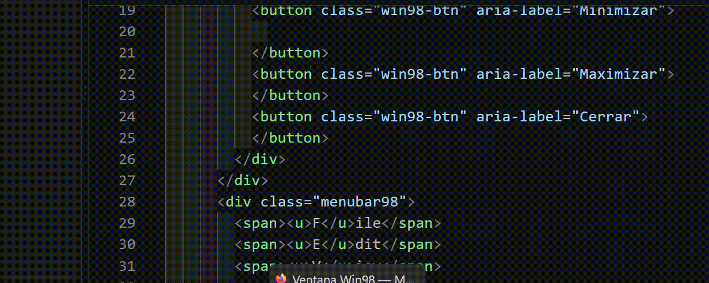

\# css-windows98

> Marco ilustrativo en css.

)

\## Qué es

Ilustración creada con HTML y CSS puro que simula un par de ventanas estilo Windows98, también se puede usar como marco de contenido.
aprendizaje aplicado by @corpoanimato 

\## Tecnologías

\- HTML

\- CSS

